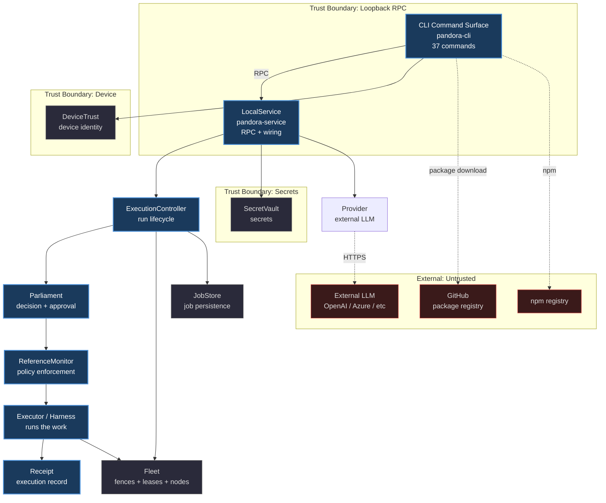

# Pandora Runtime Architecture

## High-level diagram



## Component cards

### CLI Command Surface
- **Role**: Entry point; 37 commands (setup, run, tui, job, subagent, package, memory, doctor, backup, restore, update, service, graph, fleet, ...)
- **Owns**: argument parsing, output formatting, human interaction
- **Trusts**: LocalService over authenticated loopback RPC
- **Does not**: execute work directly, hold secrets in plaintext

### LocalService
- **Role**: RPC service; wires the runtime together
- **Owns**: request routing, identity, RPC idempotency ledger, service token
- **Trusts**: ExecutionController, SecretVault, Provider
- **Does not**: make policy decisions, persist jobs

### ExecutionController
- **Role**: Run lifecycle; the start of the core chain
- **Owns**: execution id, harness/gene selection, status, run loop
- **Trusts**: Parliament, ReferenceMonitor, Fleet, JobStore
- **Does not**: decide approvals, enforce policy

### Parliament
- **Role**: Decision and approval
- **Owns**: approval decisions, human review gates
- **Trusts**: Approvals store, Human review
- **Does not**: execute work, persist state

### ReferenceMonitor
- **Role**: Policy enforcement
- **Owns**: policy version, permit TTL, authorization
- **Trusts**: Permit store, Policy context
- **Does not**: decide what to approve, execute work

### Executor / Harness
- **Role**: Runs the actual work
- **Owns**: harness execution, tool calls, gene application
- **Trusts**: Fleet (fences), Provider (inference)
- **Does not**: decide approvals, persist receipts

### Receipt
- **Role**: Execution record
- **Owns**: execution evidence, receipt id, completion status
- **Trusts**: nothing (terminal)
- **Does not**: mutate after creation

### Fleet
- **Role**: Fencing, leases, node registry
- **Owns**: fence acquire/renew/release/expire, lease renewal, node heartbeat, fence-operation registry
- **Trusts**: SQLite (WAL), trusted clock
- **Does not**: execute work, hold secrets

### JobStore
- **Role**: Job persistence
- **Owns**: job records, status transitions, SQLite sidecars
- **Trusts**: SQLite (WAL)
- **Does not**: decide job policy, execute work

### Provider
- **Role**: External LLM boundary
- **Owns**: client, failover, inference policy, structured output
- **Trusts**: external LLM endpoints
- **Does not**: hold secrets (receives them per-request), persist state

### SecretVault
- **Role**: Secrets isolation
- **Owns**: secret entries, zeroizing wrappers, exposure control
- **Trusts**: nothing (isolated)
- **Does not**: log, persist in plaintext, share across trust boundaries

### DeviceTrust
- **Role**: Device identity
- **Owns**: device key store, proof requests, attestation
- **Trusts**: OS keychain / TPM
- **Does not**: share keys across devices, persist in plaintext

## Primary path

```
CLI → LocalService → ExecutionController → Parliament → ReferenceMonitor → Executor → Receipt
```

1. **CLI** parses the command and opens an authenticated loopback RPC session
2. **LocalService** routes the request, checks identity, and starts the execution
3. **ExecutionController** acquires a fence, selects the harness/gene, and enters the run loop
4. **Parliament** decides whether the run needs approval; if so, it gates on human review
5. **ReferenceMonitor** enforces policy: permit TTL, policy version, authorization
6. **Executor** runs the work, calling the Provider for inference and the Fleet for fencing
7. **Receipt** records the execution evidence and completion status

## Trust boundaries

| Boundary | Inside | Outside | Enforcement |
| --- | --- | --- | --- |
| Loopback RPC | CLI, LocalService | network | authenticated loopback, service token |
| Secrets | SecretVault | everything else | zeroizing wrappers, no plaintext persistence |
| Device | DeviceTrust | other devices | OS keychain / TPM, attestation |
| External | Provider, GitHub client, npm | internet | HTTPS, no secrets in logs |

## External dependencies

- **External LLM** (OpenAI, Azure, etc.) — inference via Provider; untrusted content
- **GitHub** — package download; manifest + artifact
- **npm registry** — launcher and CLI distribution
- **crates.io** — Rust dependencies; audited by `cargo audit`
